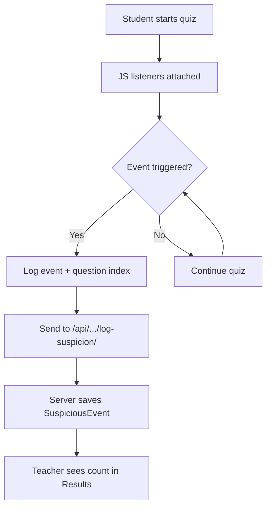
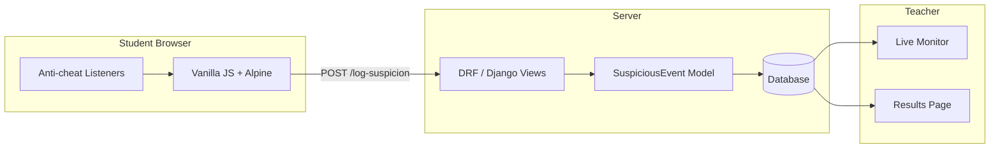
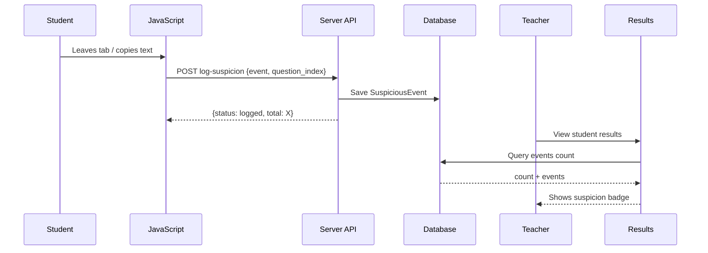

# 🛡️ Anti-Cheat System

**Simple. Effective. Transparent.**

The OQA anti-cheat system raises the cost of cheating without being overly intrusive. It logs suspicious behavior for teachers to review later.

---

## ✨ Core Features

- **Tab Switch & Window Blur Detection** — Logs when students leave the quiz tab or window.
- **Copy / Paste / Right-Click Blocking** — Prevents easy content copying.
- **Keyboard Shortcut Blocking** — Blocks common dev tools and copy shortcuts (Ctrl+C, F12, etc.).
- **Time-per-Question Logging** — Records how long each answer took.
- **Suspicion Scoring** — Teachers see a clean / low / high suspicion indicator per student.

---

## 🔄 How the Anti-Cheat Algorithm Works

### High-Level Flow



### Detailed Algorithm (Client + Server)

1. **Client Side (JavaScript in `attempt.html` + `anticheat.js`)**
   - On page load → attach event listeners:
     - `visibilitychange` → if `document.hidden` → log `tab_switch`
     - `blur` → log `window_blur`
     - `copy` / `paste` / `cut` → preventDefault + log event
     - `contextmenu` → prevent right click
     - `keydown` → block Ctrl+C, Ctrl+V, F12, etc.
   - Each detection calls:
     ```js
     logSuspicion(eventType, currentQuestionIndex)
     ```
   - Sends POST with `{ event_type, question_index, details? }`

2. **Server Side (`api.py` → `log_suspicion`)**
   - Validate session is active
   - Create `SuspiciousEvent` record
   - Return total suspicion count for that session

3. **Scoring Logic (Displayed in Results & Monitor)**
   ```python
   count = session.suspicious_events.count()

   if count == 0:
       "Clean ✅"
   elif count <= 3:
       "Minor ⚠️"
   else:
       "High 🔴"
   ```

4. **Additional Signals**
   - Extremely fast answers (time_taken_seconds very low)
   - Auto-submit due to timer
   - High number of events during difficult questions

---

## 🕵️ Suspicion Scoring Table

| Events | Level     | Color in UI     | Action for Teacher          |
|--------|-----------|-----------------|-----------------------------|
| 0      | Clean     | Green           | No action needed            |
| 1-3    | Minor     | Yellow          | Review results              |
| 4+     | High      | Red             | Investigate + possible flag |

---

## 📐 Architecture Diagram



---

## 🔁 Sequence: Anti-Cheat Event



---

## ✅ Why This Design?

- **Client is display-only** — all validation on server
- **No false accusations** — events are logged, not auto-penalized
- **Lightweight** — pure vanilla JS, no extra libraries
- **Teacher-controlled** — final decision always with the human

---

**Note:** No system is 100% cheat-proof. This system makes casual cheating much harder and gives teachers evidence when needed.

For the full Pro version, we offer enhanced detection (keystroke analysis, webcam flags, etc.) — email **clevengodsontech@gmail.com**
```