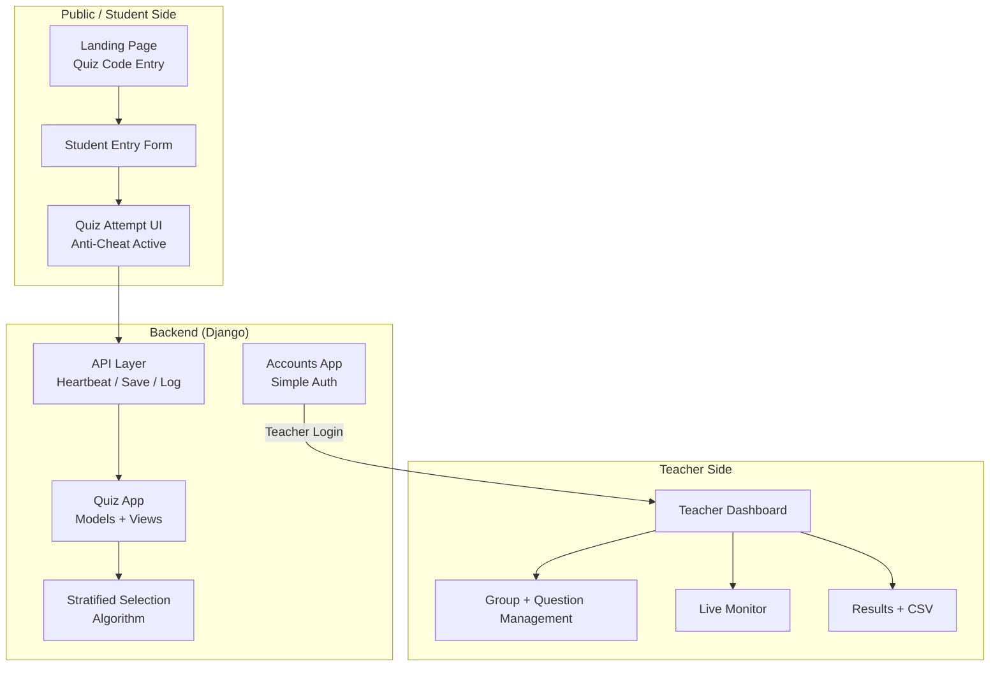
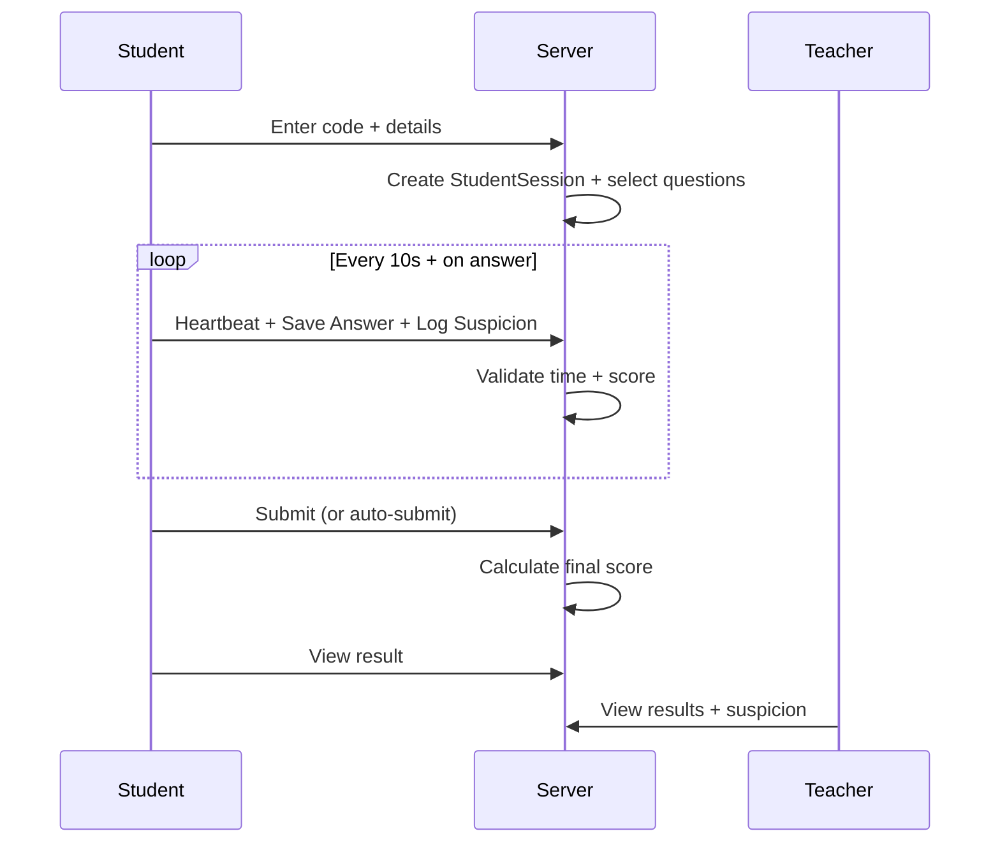

# OQA Architecture & Design

**Simple. Secure. Scalable.**

This document gives a clean visual overview of how OQA System is designed.

---

## High-Level Architecture

---

## Quiz Lifecycle (Simplified)

---

## Anti-Cheat Integration

Anti-cheat is deeply integrated but non-blocking:

- Client detects → Server records → Teacher reviews
- See [ANTI_CHEAT_ALGORITHM.md](ANTI_CHEAT_ALGORITHM.md) for full details and diagrams.

---

## Key Design Principles (Kept Simple)

- **No heavy frontend frameworks** — Vanilla + Alpine + Tailwind CDN
- **Server owns time & scoring** — Client is untrusted
- **Groups enable fairness** — Stratified random selection
- **Events are evidence, not punishment** — Teacher decides
- **Minimal dependencies** — Easy to self-host (or use Pro hosted)

---

**Contact for Pro version or custom architecture work:**  
📧 **clevengodsontech@gmail.com**

---

*Diagrams rendered with Mermaid. Simple by design.*
